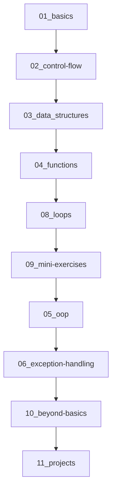

<div align="center">

# 🐍 Python Mastery
### *Complete Python Learning Journey: From Absolute Beginner to Advanced Developer*

[](https://www.python.org/)
[](https://pep8.org/)
[](LICENSE)
[](#)

*A comprehensive, hands-on repository documenting my Python learning journey with 80+ practical examples, 20+ mini-exercises, detailed comments, and real-world applications.*

[Getting Started](#-quick-start) •
[Modules](#-learning-modules) •
[Exercises](#-mini-exercises) •
[Projects](#-projects)

---

</div>

## 🌟 Overview

This repository represents a **complete, structured learning path** for mastering Python programming. Every file contains well-documented code with detailed explanations, making it perfect for beginners and intermediate learners.

### 🎯 Repository Highlights

<table>
<tr>
<td width="50%">

### 📚 **What's Inside**

- ✅ **12 Structured Modules**
- ✅ **80+ Commented Code Examples**
- ✅ **20+ Mini-Exercises**
- ✅ **Real-World Projects**
- ✅ **API Integration Examples**
- ✅ **Best Practices & Pro Tips**

</td>
<td width="50%">

### 🛠️ **Skills Mastered**

```python
✨ Python Fundamentals
🔢 Data Types & Type Casting
📝 String Manipulation
🔄 Control Flow & Loops
📦 Data Structures
🎯 Functions & OOP
⚠️ Exception Handling
📁 File Operations
🌐 API Integration
```

</td>
</tr>
</table>

---

## 📁 Complete Repository Structure

```
python-mastery/
│
├── 📘 01_basics/                         [11 files - Foundation concepts]
│   ├── 01_display.py                     # Print functions & output
│   ├── 02_variables.py                   # Variables, data types, f-strings, type annotations
│   ├── 03_type_casting.py                # Explicit & implicit type conversion
│   ├── 05_arithmetic_operators.py        # All arithmetic operations & augmented assignment
│   ├── 06_builtinmath_functions.py       # round(), abs(), pow(), max(), min()
│   ├── 07_math_module_function.py        # math.pi, sqrt(), ceil(), floor(), hypot()
│   ├── 08_string_methods.py              # find(), capitalize(), upper(), lower(), replace()
│   ├── 09_string_indexing.py             # Slicing, indexing, string reversal
│   ├── 10_format_specifiers.py           # F-string formatting flags & alignment
│   └── 11_random_numbers.py              # randint(), choice(), shuffle(), random()
│
├── 🔀 02_control-flow/                   [3 files - Decision making]
│   ├── 01_if_elif_else.py                # Conditional statements & logic
│   ├── 02_boolean_in_conditional.py      # Boolean values in conditionals
│   └── 04_conditional_expressions.py     # Ternary operator (one-line if-else)
│
├── 📦 03_data_structures/                [5 files - Collections mastery]
│   ├── 01_list.py                        # Lists: append(), insert(), sort(), reverse()
│   ├── 02_set.py                         # Sets: add(), remove(), unique values
│   ├── 03_tuple.py                       # Tuples: immutable sequences, index(), count()
│   ├── 04_2d_collections.py              # 2D lists, nested loops, matrix operations
│   └── 05_dictionary.py                  # Dictionaries: keys(), values(), items()
│
├── 🎯 04_functions/                      [3 files - Reusable code]
│   ├── 01_functions.py                   # Function basics, return statements, parameters
│   ├── 02_default_arguments.py           # Default parameter values
│   └── 03_keyword_arguments.py           # Named arguments & flexibility
│
├── 🏗️ 05_oop/                           [1 file - Object-Oriented Programming]
│   └── 02_class_variables.py             # Classes, objects, __init__(), class vs instance vars
│
├── ⚠️ 06_exception-handling/            [1 file - Error management]
│   └── exception_handling.py             # try, except, finally, specific exceptions
│
├── 📁 07_file-handling/                  [Empty - Future content]
│
├── 🔄 08_loops/                          [2 files - Iteration]
│   ├── 01_while_loops.py                 # While loops, input validation
│   └── 02_for_loops.py                   # For loops, range(), break, continue
│
├── 💪 09_mini-exercises/                 [20+ exercises - Practice problems]
│   ├── 01_mad_libs_game.py               # Interactive story game
│   ├── 02_area_calc.py                   # Rectangle area & volume calculator
│   ├── 03_shopping_cart.py               # Shopping cart with total calculation
│   ├── 05_circle_area.py                 # Circle area using math.pi
│   ├── 07_food_check.py                  # Y/N input validation
│   ├── 08_name_checker.py                # Empty string validation
│   ├── 13_creditcard_last4.py            # String slicing & reversal
│   ├── 17_countdown_timer.py             # Time module, formatted timer
│   ├── 18_shopping_cart.py               # Advanced cart with lists
│   └── 19_keypad_2d.py                   # 2D tuple iteration
│
├── 🚀 10_beyond-basics/                  [1 file - Advanced concepts]
│   └── api.py                            # REST API integration (PokeAPI)
│
├── 🎨 11_projects/                       [Empty - Future projects]
│
└── 📝 12_notes/                          [Empty - Learning notes]
```

---

## 📖 Detailed Module Breakdown

### Module 1️⃣: Python Basics (11 Files)

<details>
<summary><b>🔍 Click to expand - Foundation Concepts</b></summary>

#### **01_display.py - Your First Python Program**
```python
print("I like Pizza")
print("It's really good!")

# Multiple arguments
month = "September"
print("Investigate failed login attempts during", month, "if more than", 100)
```

#### **02_variables.py - Data Types & F-Strings**
```python
# Four main data types
name = "Abdul"        # String
age = 22              # Integer
gpa = 3.2             # Float
is_student = True     # Boolean

# F-string formatting
print(f"Hello {name}")
print(f"You are {age} years old")

# Type annotations
age: int = 34
car: str = "Mustang"

# Advanced typing
import typing
List_of_numbers: typing.List[int] = [1, 2, 3]
```

#### **03_type_casting.py - Type Conversion**
```python
# Explicit type casting
age = "21"
age = int(age)        # String → Integer

gpa = 3.2
gpa = int(gpa)        # Float → Integer (3)

# isinstance() validation
price = "hello"
if isinstance(price, (int, float)):
    print("Valid numeric value")
else:
    print("Invalid type")
```

#### **08_string_methods.py - String Manipulation**
```python
name = "Abdul Rehman"

# Common methods
print(name.upper())           # ABDUL REHMAN
print(name.lower())           # abdul rehman
print(name.capitalize())      # Abdul rehman
print(name.find("R"))         # 6
print(name.count("a"))        # 2
print(name.replace(" ", "-")) # Abdul-Rehman
print(name.isalpha())         # False (space)
```

#### **09_string_indexing.py - Slicing & Indexing**
```python
credit_number = "1234-5678-9012-3456"

print(credit_number[0])       # 1
print(credit_number[:4])      # 1234
print(credit_number[5:9])     # 5678
print(credit_number[-4:])     # 3456
print(credit_number[::2])     # 13-68002-46
print(credit_number[::-1])    # Reverse: 6543-2109-8765-4321
```

#### **10_format_specifiers.py - Advanced Formatting**
```python
price1 = 3000.14159

# Decimal places
print(f"Price: ${price1:.2f}")         # $3000.14

# Alignment
print(f"Price: ${price1:<10}")         # Left justify
print(f"Price: ${price1:>10}")         # Right justify
print(f"Price: ${price1:^10}")         # Center align

# Special formatting
print(f"Price: ${price1:+,.2f}")       # +3,000.14
print(f"Price: ${price1:010}")         # 003000.14159
```

#### **11_random_numbers.py - Random Module**
```python
import random

# Random integer
number = random.randint(1, 100)

# Random float (0.0 to 1.0)
value = random.random()

# Random choice
options = ("rock", "paper", "scissors")
choice = random.choice(options)

# Shuffle
cards = ["2", "3", "4", "5", "6", "7", "8", "9", "J", "Q", "K", "A"]
random.shuffle(cards)
```

</details>

---

### Module 2️⃣: Control Flow (3 Files)

<details>
<summary><b>🔀 Click to expand - Decision Making</b></summary>

#### **01_if_elif_else.py**
```python
age = int(input("Enter your age: "))

if age >= 100:
    print("You are too old to sign up")
elif age >= 18:
    print("You are now signed up!")
elif age < 0:
    print("You haven't born yet!")
else:
    print("You must be 18+ to sign up!")
```

#### **04_conditional_expressions.py - Ternary Operator**
```python
# One-line if-else
num = 5
print("Positive" if num > 0 else "Negative")

# Find max/min
a, b = 6, 7
max_num = a if a > b else b
min_num = a if a < b else b

# Access control
user_role = "guest"
access_level = "Full Access" if user_role == "admin" else "Limited Access"
```

</details>

---

### Module 3️⃣: Data Structures (5 Files)

<details>
<summary><b>📦 Click to expand - Collections Mastery</b></summary>

#### **01_list.py - Lists (Ordered, Mutable)**
```python
fruits = ["apple", "orange", "banana", "coconut"]

# Key operations
fruits.append("mango")           # Add to end
fruits.insert(0, "grape")        # Insert at index
fruits.remove("apple")           # Remove by value
fruits.sort()                    # Sort alphabetically
fruits.reverse()                 # Reverse order
print(fruits.index("banana"))    # Find index
print(fruits.count("banana"))    # Count occurrences

# Slicing
print(fruits[:3])                # First 3 elements
print(fruits[::-1])              # Reverse list
```

#### **02_set.py - Sets (Unordered, Unique)**
```python
fruits = {"apple", "orange", "banana", "coconut", "apple"}
# Duplicates automatically removed

fruits.add("pineapple")          # Add element
fruits.remove("apple")           # Remove element
print("orange" in fruits)        # Check membership (True)
```

#### **03_tuple.py - Tuples (Immutable)**
```python
fruits = ("apple", "orange", "banana", "coconut")

# Cannot modify, but can:
print(fruits.index("apple"))     # Find index
print(fruits.count("coconut"))   # Count occurrences

# Faster than lists due to immutability
```

#### **04_2d_collections.py - 2D Data Structures**
```python
# 2D list (matrix/grid)
groceries = [
    ["apple", "orange", "banana", "coconut"],
    ["celery", "carrots", "potatoes"],
    ["chicken", "fish", "turkey"]
]

# Access elements
print(groceries[0][0])           # apple

# Nested loops
for row in groceries:
    for item in row:
        print(item, end=" ")
    print()
```

#### **05_dictionary.py - Dictionaries (Key-Value Pairs)**
```python
capitals = {
    "Pakistan": "Islamabad",
    "India": "Delhi",
    "USA": "Washington D.C."
}

# Methods
print(capitals.get("USA"))       # Washington D.C.
capitals.update({"Germany": "Berlin"})
capitals.pop("India")

# Iteration
for key in capitals.keys():
    print(key)

for value in capitals.values():
    print(value)

for key, value in capitals.items():
    print(f"{key}: {value}")
```

</details>

---

### Module 4️⃣: Functions (3 Files)

<details>
<summary><b>🎯 Click to expand - Reusable Code</b></summary>

#### **01_functions.py**
```python
# Basic function with return
def add(x, y):
    return x + y

def create_name(first, last):
    first = first.capitalize()
    last = last.capitalize()
    return first + " " + last

# Usage
result = add(5, 3)                        # 8
full_name = create_name("abdul", "rehman")  # Abdul Rehman
```

#### **02_default_arguments.py**
```python
def net_price(list_price, discount=0, tax=0.05):
    return list_price * (1 - discount) * (1 + tax)

print(net_price(500))           # Uses defaults
print(net_price(500, 0.1))      # Custom discount
print(net_price(500, 0.1, 0))   # Custom both
```

#### **03_keyword_arguments.py**
```python
def hello(greeting, title, first, last):
    print(f"{greeting} {title}{first} {last}")

# Order doesn't matter with keywords
hello("Hello", first="Bilal", last="Raza", title="Mr.")

# Built-in keyword arguments
print(1, 2, 3, 4, 5, sep="-")    # 1-2-3-4-5
print("Hello", end=" ")          # No newline
```

</details>

---

### Module 5️⃣: Object-Oriented Programming (1 File)

<details>
<summary><b>🏗️ Click to expand - OOP Fundamentals</b></summary>

#### **02_class_variables.py**
```python
class Student:
    class_year = 2025          # Class variable (shared)
    num_students = 0
    
    def __init__(self, name, age):
        self.name = name        # Instance variable
        self.age = age
        Student.num_students += 1
    
student1 = Student("Bilal", 20)
student2 = Student("Ahmad", 21)

print(f"Total students: {Student.num_students}")  # 2
print(f"Class of {Student.class_year}")           # 2025
```

**Key OOP Concepts:**
- ✅ `__init__()` constructor
- ✅ `self` parameter
- ✅ Instance vs class variables
- ✅ Object creation

</details>

---

### Module 6️⃣: Exception Handling (1 File)

<details>
<summary><b>⚠️ Click to expand - Error Management</b></summary>

#### **exception_handling.py**
```python
try:
    number = int(input("Enter a number: "))
    print(1 / number)
except ZeroDivisionError:
    print("You can't divide by zero!")
except ValueError:
    print("Enter only numbers please!")
except Exception:
    print("Something went wrong!")
finally:
    print("Do some cleanup here")
```

**Exception Types Covered:**
- `ZeroDivisionError` - Division by zero
- `ValueError` - Invalid type conversion
- `TypeError` - Wrong data type operations
- Generic `Exception` handling

</details>

---

### Module 8️⃣: Loops (2 Files)

<details>
<summary><b>🔄 Click to expand - Iteration Mastery</b></summary>

#### **01_while_loops.py - Input Validation**
```python
# Empty name validation
name = input("Enter your name: ")
while name == "":
    print("You didn't enter your name")
    name = input("Enter your name: ")

# Range validation
num = int(input("Enter a number between 1 and 10: "))
while num < 1 or num > 10:
    print("Out of range!")
    num = int(input("Enter a number between 1 and 10: "))
```

#### **02_for_loops.py - Range & Iteration**
```python
# Forward iteration
for x in range(1, 11):
    print(x)              # 1 to 10

# Backward iteration
for x in range(10, 0, -1):
    print(x)              # 10 to 1

# Step iteration
for x in range(1, 11, 2):
    print(x)              # 1, 3, 5, 7, 9

# String iteration
credit_card = "1234-5678-9012-3456"
for char in credit_card:
    print(char, end=" ")

# break vs continue
for x in range(1, 21):
    if x == 13:
        continue          # Skip 13
    print(x)
```

</details>

---

### Module 9️⃣: Mini-Exercises (20+ Files)

<details>
<summary><b>💪 Click to expand - Practice Problems</b></summary>

| Exercise | Description | Key Concepts |
|----------|-------------|--------------|
| **01_mad_libs_game.py** | Interactive story with user input | F-strings, input() |
| **02_area_calc.py** | Rectangle area & volume calculator | Arithmetic operations, float |
| **03_shopping_cart.py** | Simple shopping cart | Variables, round() |
| **05_circle_area.py** | Circle area using π | math.pi, pow() |
| **07_food_check.py** | Y/N validation | .upper(), conditionals |
| **08_name_checker.py** | Empty string check | String validation |
| **13_creditcard_last4.py** | Last 4 digits, reversal | String slicing [::-1] |
| **17_countdown_timer.py** | Formatted countdown | time.sleep(), formatting |
| **18_shopping_cart.py** | Advanced cart with lists | Lists, while loops |
| **19_keypad_2d.py** | Phone keypad display | 2D tuples, nested loops |

#### **Featured Exercise: Countdown Timer**
```python
import time

my_time = int(input("Enter time in seconds: "))

for x in range(my_time, 0, -1):
    seconds = x % 60
    minutes = x // 60 % 60
    hours = x // 3600
    print(f"{hours:02}:{minutes:02}:{seconds:02}")
    time.sleep(1)

print("TIME'S UP!")
```

</details>

---

### Module 🔟: Beyond Basics (1 File)

<details>
<summary><b>🚀 Click to expand - Advanced Concepts</b></summary>

#### **api.py - REST API Integration (PokeAPI)**
```python
import requests

base_url = "https://pokeapi.co/api/v2/"

def get_pokemon_info(name):
    url = f"{base_url}/pokemon/{name}"
    response = requests.get(url)
    
    if response.status_code == 200:
        pokemon_data = response.json()
        return pokemon_data
    else:
        print(f"Failed to retrieve data {response.status_code}")

# Usage
pokemon_name = input("Enter pokemon: ")
pokemon_info = get_pokemon_info(pokemon_name)

if pokemon_info:
    print(f"Name: {pokemon_info['name'].capitalize()}")
    print(f"ID: {pokemon_info['id']}")
    print(f"Height: {pokemon_info['height']}")
    print(f"Weight: {pokemon_info['weight']}")
```

**Concepts Covered:**
- HTTP requests with `requests` library
- JSON data parsing
- Status code handling
- Dictionary access
- Functions with return values

</details>

---

## 🚀 Quick Start

### Prerequisites

```bash
Python 3.11+ installed
Basic command line knowledge
```

### Installation & Running

```bash
# Clone the repository
git clone https://github.com/AbdulRehman393/python-mastery.git
cd python-mastery

# Run any example
python 01_basics/01_display.py

# Run an exercise
python 09_mini-exercises/17_countdown_timer.py

# Run API example (install requests first)
pip install requests
python 10_beyond-basics/api.py
```

---

## 💡 Key Learning Highlights

### 🎓 Coding Best Practices Demonstrated

| Practice | Implementation | Examples |
|----------|---------------|----------|
| **Detailed Comments** | Every file has explanatory comments | All 80+ files |
| **PEP 8 Style** | Consistent naming, spacing | Throughout repo |
| **Type Annotations** | Modern Python typing | `02_variables.py` |
| **Error Handling** | Try-except blocks | `exception_handling.py` |
| **Input Validation** | User input checks | `01_while_loops.py` |
| **DRY Principle** | Reusable functions | `04_functions/` |
| **F-Strings** | Modern string formatting | All modules |

### 📊 Learning Progress Tracker

```
✅ Python Basics (11 files)          [██████████] 100%
✅ Control Flow (3 files)             [██████████] 100%
✅ Data Structures (5 files)          [██████████] 100%
✅ Functions (3 files)                [██████████] 100%
✅ OOP Fundamentals (1 file)          [██████████] 100%
✅ Exception Handling (1 file)        [██████████] 100%
✅ Loops (2 files)                    [██████████] 100%
✅ Mini-Exercises (20+ files)         [██████████] 100%
✅ API Integration (1 file)           [██████████] 100%
🔄 File Handling                      [░░░░░░░░░░] 0%
🔄 Advanced Projects                  [░░░░░░░░░░] 0%
```

---

## 🎯 Learning Path Recommendation



**Suggested Study Order:**
1. ✅ **Start with 01_basics** - Build foundation (display, variables, strings)
2. ✅ **Move to 02_control-flow** - Learn decision making
3. ✅ **Master 03_data_structures** - Lists, sets, tuples, dictionaries
4. ✅ **Learn 04_functions** - Write reusable code
5. ✅ **Practice 08_loops** - While and for loops
6. ✅ **Complete 09_mini-exercises** - Apply your knowledge
7. ✅ **Study 05_oop** - Object-oriented programming
8. ✅ **Handle 06_exception-handling** - Error management
9. ✅ **Explore 10_beyond-basics** - API integration
10. 🚀 **Build 11_projects** - Real-world applications

---

## 📚 Resources & References

### Official Documentation
- 📖 [Python Official Docs](https://docs.python.org/3/)
- 🐍 [Python Tutorial](https://docs.python.org/3/tutorial/)
- 📘 [PEP 8 Style Guide](https://pep8.org/)
- 🔤 [Python String Methods](https://docs.python.org/3/library/stdtypes.html#string-methods)

### Tools Used
- **IDE**: VS Code / PyCharm
- **Version Control**: Git & GitHub
- **Libraries**: `math`, `random`, `time`, `requests`, `typing`

### Next Steps
- 📁 Complete file handling module
- 🎨 Build real-world projects
- 🌐 More API integrations
- 🗄️ Database operations (SQLite)
- 📊 Data analysis with Pandas
- 🖼️ GUI development with Tkinter

---

## 🤝 Contributing

Found a bug or want to improve an example? Contributions are welcome!

```bash
# Fork the repo
# Create a feature branch
git checkout -b feature/ImprovedExample

# Commit changes
git commit -m "Improved example in 01_basics"

# Push and create PR
git push origin feature/ImprovedExample
```

---

## 📝 License

This project is licensed under the MIT License - feel free to use these examples for learning!

---

## 👨‍💻 Author

**Abdul Rehman**

[](https://github.com/AbdulRehman393)
[](https://github.com/AbdulRehman393/python-mastery)

---

## ⭐ Support This Project

If this repository helped you learn Python:

- ⭐ **Star this repository**
- 🍴 **Fork it for your own learning**
- 📢 **Share it with other learners**
- 💬 **Open issues for questions**
- 🔔 **Watch for new updates**

---

<div align="center">

### 🚀 Start Your Python Journey Today!

**[Explore the Code](./01_basics)** | **[Try Exercises](./09_mini-exercises)** | **[Build Projects](./11_projects)**

---

*Built with ❤️ and lots of ☕ by Abdul Rehman*

**Last Updated:** February 2026

</div>
